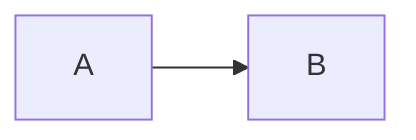

<head>
<link
    href="https://cdn.pydata.org/bokeh/release/bokeh-3.3.4.min.css"
    rel="stylesheet" type="text/css">

</head>

INTOXICATE
#### Background 
X Developed INTOXICATE to determine which poisoned patients need admission to the ICU/Stepdown unit. Below is the model. SBPS refers to systolic blood pressure. EMV refers to the Glasgow Coma Scale (eye, motor, verbal).

 $$ \textrm{risk} = \begin{bmatrix} -1.75 \\ -0.91398 \\ 0.25399 \\ 0.061925 \\ 0.162626 \\ -0.265 \\ -1.22151 \\ 0.325561 \\ 0.038357 \\ 0.014 \\ -0.02035 \\ -0.164725 \\ 1.527795 \\ 1.423788 \\ 0.983364 \\ 1.289260 \\  \end{bmatrix} \cdot 
\begin{bmatrix} 1 \\ \textrm{alcohol} \\ \textrm{analgesic}\\ \textrm{antidepressant}\\ \textrm{street drug}\\ \textrm{sedative}\\ \textrm{poison}\\ \textrm{other}\\ \textrm{Age}\\ \textrm{Pulse}\\ \textrm{SBP}\\ \textrm{EMV}\\ \textrm{Respiratory insufficiency}\\ \textrm{Cirrhosis}\\ \textrm{Dysrhythmia}\\ \textrm{Second reason of ICU admission}\\ \end{bmatrix} $$ 

#### TODO
**Important Dates**:
1. NYACEP (Abstract Deadline 4/1/2024)
1. HICSS (Abstract Deadline 6/15/2024)
1. WCM Ressearch Day (April 5, 2024)

#### Coding 

| Coding Value  | Suspected intoxicant    |
| :---------: | :------------: |
| 1   | Alcohol   |
| 2   | Analgesic   |
| 3   | Antidepressants   |
| 4   | Street Drugs   |
| 5 | Sedatives |
| 6 | CO, As, CN | 
| 7 | Toxin NOS | 
| 8 | Combination |
| | |
| | |
| | **Age** |
| 0 | <25 |
| 2 | 25-35 |
| 4 | 35-45 |
| 6 | 45-55 |
| 8 | 55-65 |
| 10 | $\geq$ 65 |
| | |
| | |
| | **SBP** |
| -3 | $\geq$ 140 |
| -1 | 130-140 |
| 0 | 120-130 
| 1 | 110-120 |
| 2 | 100-110 |
| 4 | < 100 |
| | | 
| | | 
| | **HR** | 
| 0 | < 75 | 
| 1 | 75-85 |
| 2 | 85-95 |
| 3 | 95-105 |
| 4 | $\geq$ 105 |
| | |
| | |
| | **GCS**
| 0 | $\geq$ 14 |
| 3 | 9-14 |
| 6 | 6-9 |
| 9 | $\leq$ 6 |

There is before bort.

And after bort.
