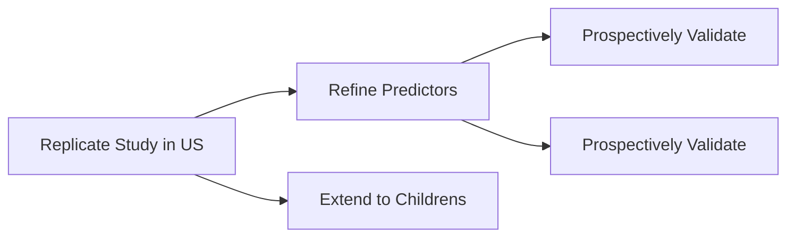

<head>
<link
    href="https://cdn.pydata.org/bokeh/release/bokeh-3.3.4.min.css"
    rel="stylesheet" type="text/css">

</head>

#### Which Poisoned Patients Need the ICU?

**Background.**

1. Fraction of poisoned patients each year admitted to ICU/Stepdown
1. Physiology of poisoning means that scoring systems meant to determine general illness like APACHE may not work.
1. X previously developed INTOXICATE with _methods_ that had _results_.

**Project Roadmap**

 Developed INTOXICATE to determine which poisoned patients need admission to the ICU/Stepdown unit. Below is the model. SBPS refers to systolic blood pressure. EMV refers to the Glasgow Coma Scale (eye, motor, verbal).

And after bort.

#### References


