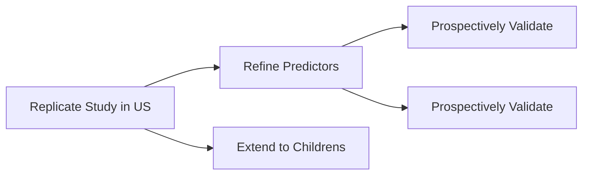

<head>
<link
    href="https://cdn.pydata.org/bokeh/release/bokeh-3.3.4.min.css"
    rel="stylesheet" type="text/css">

</head>



#### Which Poisoned Patients Need the ICU?

**Background.**

1. Fraction of poisoned patients each year admitted to ICU/Stepdown
1. Physiology of poisoning means that scoring systems meant to determine general illness like APACHE may not work.
1. X previously developed INTOXICATE with _methods_ that had _results_.

**Project Roadmap**

 Developed INTOXICATE to determine which poisoned patients need admission to the ICU/Stepdown unit. Below is the model. SBPS refers to systolic blood pressure. EMV refers to the Glasgow Coma Scale (eye, motor, verbal).

$$
\textrm{risk} = \begin{bmatrix} -1.75 \\ -0.91398 \\ 0.25399 \\ 0.061925 \\ 0.162626 \\ -0.265 \\ -1.22151 \\ 0.325561 \\ 0.038357 \\ 0.014 \\ -0.02035 \\ -0.164725 \\ 1.527795 \\ 1.423788 \\ 0.983364 \\ 1.289260 \\  \end{bmatrix} \cdot
\begin{bmatrix} 1 \\ \textrm{alcohol} \\ \textrm{analgesic}\\ \textrm{antidepressant}\\ \textrm{street drug}\\ \textrm{sedative}\\ \textrm{poison}\\ \textrm{other}\\ \textrm{Age}\\ \textrm{Pulse}\\ \textrm{SBP}\\ \textrm{EMV}\\ \textrm{Respiratory insufficiency}\\ \textrm{Cirrhosis}\\ \textrm{Dysrhythmia}\\ \textrm{Second reason of ICU admission}\\ \end{bmatrix}
$$

<h4>Encoding of Categorical Variables</h4>
<h4>Conversion of Numerical Variables into Categories</h4>

<table>
<thead>
<th style="text-align: right">Intoxicant</th>
<th style="text-align: center">&nbsp;&nbsp;</th>
<th style="text-align: center">Value</th>
</thead>
<tbody>

<tr> 
  <td style="text-align: right"> {{ intoxicant.name }} </td> 
  <td>&nbsp;&nbsp;</td>
  <td style="text-align: center"> {{ intoxicant.value }} </td>
</tr>

</tbody>
</table>

<table>
<thead>
<th style="text-align: right">Age Group</th>
<th style="text-align: center">&nbsp;&nbsp;</th>
<th style="text-align: center">Value</th>
</thead>
<tbody>

<tr> 
  <td style="text-align: right"> {{ age.name }} </td> 
  <td>&nbsp;&nbsp;</td>
  <td style="text-align: center"> {{ age.value }} </td>
</tr>

</tbody>
</table>

<table>
<thead>
<th style="text-align: right">SBP</th>
<th style="text-align: center">&nbsp;&nbsp;</th>
<th style="text-align: center">Value</th>
</thead>
<tbody>

<tr> 
  <td style="text-align: right"> {{ sbp.name }} </td> 
  <td>&nbsp;&nbsp;</td>
  <td style="text-align: center"> {{ sbp.value }} </td>
</tr>

</tbody>
</table>

 

<table>
<thead>
<th style="text-align: right">Pulse</th>
<th style="text-align: center">&nbsp;&nbsp;</th>
<th style="text-align: center">Value</th>
</thead>
<tbody>

<tr> 
  <td style="text-align: right"> {{ pulse.name }} </td> 
  <td>&nbsp;&nbsp;</td>
  <td style="text-align: center"> {{ pulse.value }} </td>
</tr>

</tbody>
</table>

<table>
<thead>
<th style="text-align: right">GCS</th>
<th style="text-align: center">&nbsp;&nbsp;</th>
<th style="text-align: center">Value</th>
</thead>
<tbody>

<tr> 
  <td style="text-align: right"> {{ gcs.name }} </td> 
  <td>&nbsp;&nbsp;</td>
  <td style="text-align: center"> {{ gcs.value }} </td>
</tr>

</tbody>
</table>

There is before bort.

And after bort.

#### References


