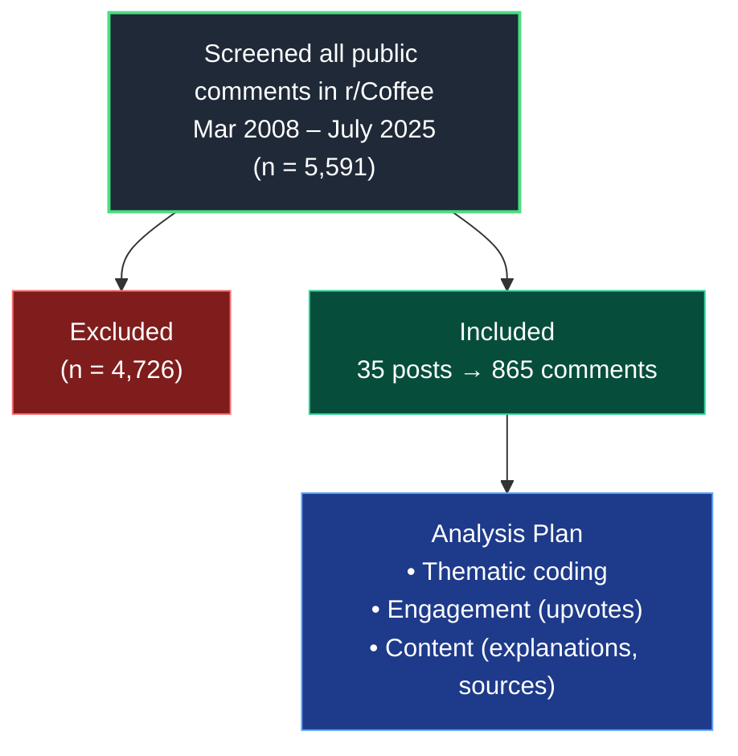


Macuna and Coffee content


> Thank you for viewing our poster at ACMT 2026 . Here is a [digital copy](../pdfs/2026.acmt.poster.coffee.pdf){:target="\_blank"} of the poster.

## Mycotoxins

There are unsubstantiated claims about the health effects of mycotoxins in coffee. We sought to understand how communities respond to such claims by analyzing posts and comments in r/Coffee, a large online community of coffee enthusiasts.

#### Research Question: **How do online communities discuss and respond to misinformation about harmful amounts of mycotoxins in coffee?**

##  Study Overview

| Step | Description | Count |
|------|------------|------:|
| Screened | All public comments in r/Coffee (Mar 2008 – Jul 2025) | 5,591 |
| Excluded | Did not contain mycotoxin-related terms | 4,726 |
| Included posts | Posts containing “mycotoxin” or variants | 35 |
| Unique comments | Comments analyzed | 865 |

##  Analysis Framework

| Domain | Description |
|-------|------------|
| Thematic coding | Refuting, questioning, or concurring with misinformation |
| Engagement | Measured via upvotes |
| Content type | Explanation vs citation vs neither |

## Results: Distribution of Comments

| Category | Count |
|---------|------:|
| Total comments | 865 |
| Indirectly address topic | 585 |
| Directly address topic | 130 |

##  Rhetorical Stance for Directly Addressing Comments

| Stance | Count | % |
|--------|------:|--:|
| Refuting | 99 | 76% |
| Questioning | 8 | 6% |
| Concurring | 23 | 18% |

##  Content Type by Stance

| Content Type | Refuting | Questioning | Concurring |
|--------------|---------:|------------:|-----------:|
| Explanations of Manufacturing | 63 | 0 | 0 |
| Anecdotes | 0 | 0 | 9 |
| Outside sources | 19 | 0 | 2 |

## Engagement

### By stance

| Group | Median | IQR | Interpretation |
|------|-------:|----:|---------------|
| Refuting | 4 | 2–5 | Higher engagement |
| Supporting | 2 | 1–2 | Lower engagement |

### By content type

| Content | Median | IQR |
|--------|-------:|----:|
| Explanation | 3.5 | 2–9 |
| Citation only | 2 | 1–5 |
| Both | 4 | 1.5–9.5 |
| Neither | 3 | 2–7 |

##  Key Findings

| Finding | Interpretation |
|--------|----------------|
| Majority of comments refute misinformation | Community tends to challenge false claims |
| Explanatory comments perform best | Narrative + reasoning drives engagement |
| Manufacturing knowledge is key | Domain-specific expertise used in refutation |
| Citations alone less effective | Context matters more than references alone |

##  Limitations

| Limitation | Impact |
|-----------|--------|
| Single subreddit (r/Coffee) | Limited generalizability |
| Manual coding | Potential subjectivity |
| Small sample of relevant posts | Reduced statistical power |

## Conclusions

1. **Most visible refutations used narratives.** Refuting comments received the most upvotes when they included an explanation with sources cited: **4 \[1.5–9.5\]** versus **2 \[1–5\]** when they did not include a narrative.
2. **Choice of sources.** Refuting comments cited manufacturing processes demonstrating that coffee, in general, does not have appreciable levels of ochratoxin A or aflatoxins. Supporting comments cited sources discussing the potential dangers of those mycotoxins.
3. **Auto-regulation.** Comments providing explanations or citing sources received more engagement than those that did not. These findings suggest that some online communities may effectively self-correct misinformation, highlighting opportunities for collaboration between domain experts and engaged lay communities.
4. **Limitations.** One social media community may not adequately represent the relevant population; comments were manually coded; the total number of relevant comments was small.

> In r/Coffee, misinformation about mycotoxins was challenged through domain-specific explanations and the citation of academic and governmental sources.

### Mucuna pruriens. 

See [this notebook]() for an analysis of online discussions about the use of Mucuna pruriens, a plant that contains L-DOPA and is used in the treatment of Parkinson's disease.
