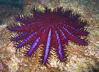
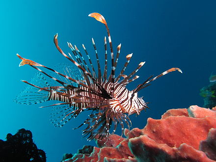

_Acanthaster planci_

* Contain saponins (amphipathic glycosides; hemolytic toxins
* Creaty forthy water 
* Most common in coral reefs in Australia

---
Sapnonins 

* Tripertine or cholesterol complexed with glucose
* Bind to cholesterol in plasma membranes; create pores

---
Lionfish (_Pterois_ genus)

* Alternating bright bands of color, in Indo-Pacific
* Venomous fin rays 
* Venom = negative inotrope, chronotrope from NO release
* In humans, pain, GI upset

---
_Synanceya spp_ (Stonefish)

* Lachrymal saber

---
