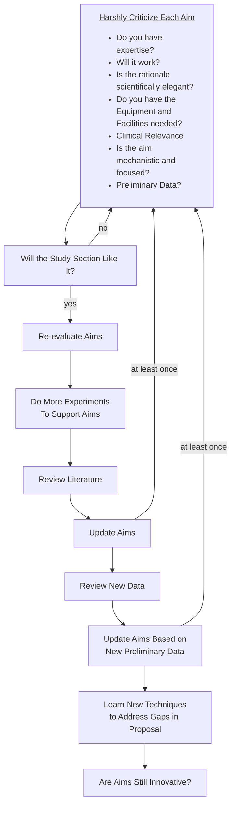

A few days ago I read <a href="https://www.nature.com/articles/s41390-022-02017-8">this article</a> that gives young researchers a 32-step guide on how to get federal funding. I summarize their paper in the below flowchart. I appreciate the detailed guidance the authors provide, but their proposal focusses on process while ignoring the cost on the individual and rarety of the appropriately fertile milieu.

- There are more than 32 steps if one counts loops. This is too much to do well in one year.
- There is no discussion of who will fund you while you are doing this work. If someone else is paying you, you will not have the freedom to make your own proposal while generating content for them. If you are working clinically, you won't have time unless you are given staff. Why would a clinical department give you protected time, pay for someone to cover the clinical work they are _protecting_ you from, and pay for your staff unless they are confident their investment in you will pay off? (The article is adressed to reseachers without funding.)

