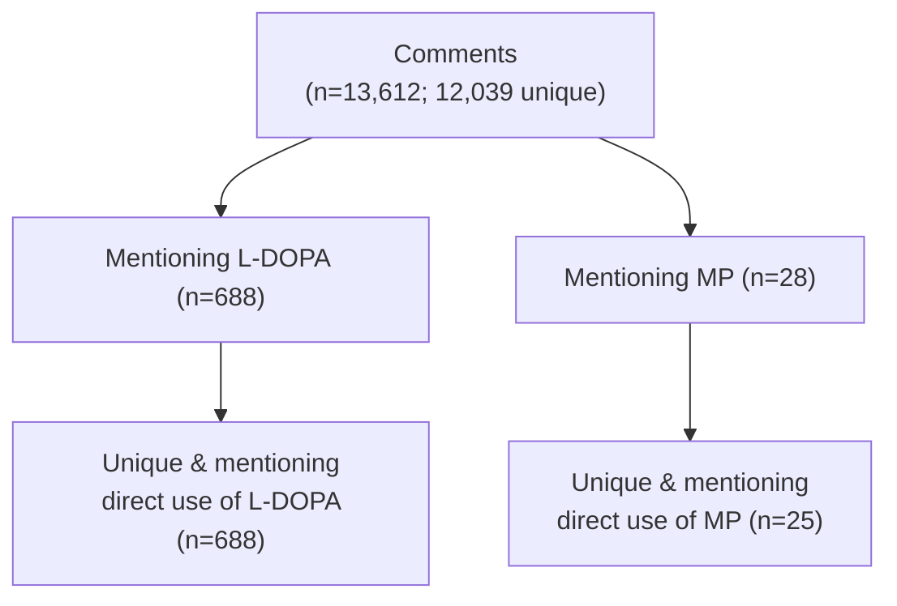

> Thank you for viewing our [poster](){:target="\_blank"} at #ACMT2025. 

### TLDR
 - Discussions on Reddit about Mucuna pruriens (MP) are mainly about its use for self-treatment of Parkinson's Disease (PD) and self-diagnosis. 

- Infrequent discussion of side effects or interactions with other medications, but frequent mention of the lack of regulation of herbal and dietary supplements (HDS) leading to unreliable dosing.

### Introduction

- Parkinson’s Disease results from loss of dopamine-producing neurons. The main treatment is levodopa (L-DOPA).
- Approximately 60% of patients with mild or moderate Parkinson’s use herbal and dietary supplements (HDS) including Mucuna pruriens (MP), which contains 2-40% L-DOPA.
- HDS use may interfere with physician treatment.
- Patients rarely disclose HDS use to physicians but frequently discuss HDS use for other conditions in online forums.
- We have shown online forums as a valid source of information on substance usage2,3. 
- Analysis of discussions in online forums may  identify reasons for HDS use and non-adherence to standard therapy

### Methods

     
__Data Acquisition.__ Author MC wrote custom software in R and Python to extract all comments and posts from the subreddit r/Parkinson’s from the start of the subreddit to January 2025. The software is available on GitHub at https://github.com/mac389/abortifacient_misinformation.git. 

__Data Preprocessing.__ We manually standardized comments, replacing brand names with generic names, expanded abbreviations, and corrected misspellings. We counted multiple identical posts by one user as one comment. 

__Data Analysis.__

_Perception._  We manually labelled each comment for (1) mentioning MP, (2) mentioning L-DOPA, (3) if the experience was positive, negative, neither, or both. 

_Thematic Analysis._ We conducted two rounds of qualitative analysis to identify themes in the post and then group post and comments by theme.
**Data Acquisition**. Author MC wrote custom software in R and Python to extract all comments and posts from the subreddit r/Parkinson’s from the start of the subreddit to January 2025. The software is available on <a href="https://github.com/mac389/abortifacient_misinformation" target="_blank">GitHub</a>.

**Data Preprocessing**. We manually standardized comments, replacing brand names with generic names, expanded abbreviations, and corrected misspellings. We counted multiple identical posts by one user as one comment. 

**Data Analysis**. 
Perception.  We manually labelled each comment for (1) mentioning MP, (2) mentioning L-DOPA, (3) if the experience was positive, negative, neither, or both. 

### Results 

### Conclusions 
Users discuss the benefits, risks, and motivations for using MP in online forums.

Users turn to Mucuna:
- To self-diagnose or self-treat while waiting to see a Parkinson’s specialist
- From dissatisfaction with pharmaceutical levodopa
- To supplement their pharmaceutical regimens for better control of symptoms 

The doses discussed of L-DOPA via MP are generally lower than L-DOPA via pharmaceuticals

Many comments discuss pharmacological properties and theoretical effects, not personal use

_Next Steps_.  
- Prospective observational cohort with testing of samples, like .
 but with assessment of effect using Unified Parkinson's Disease Rating Scale.

- Similar study across multiple forums

- Analysis of other compounds in MP that may potentiate L-DOPA or have disease-modifying effects

### References 


