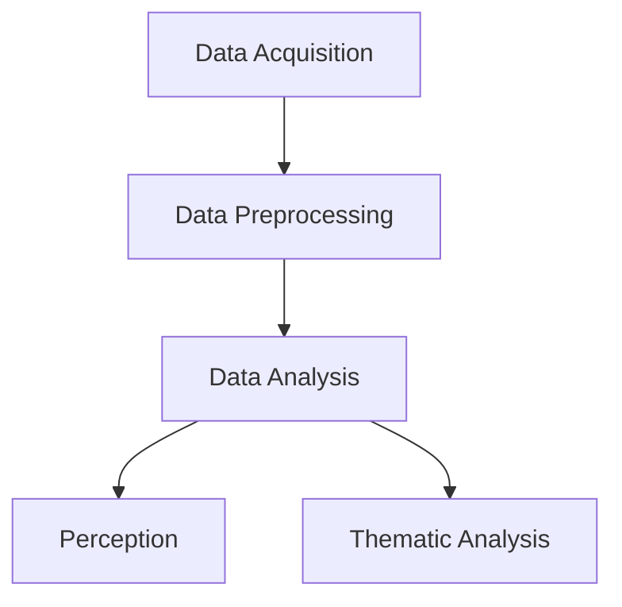

> Thank you for viewing our [poster](){:target="\_blank"} at #ACMT2025. 

### TLDR

### Introduction

- Parkinson’s Disease results from loss of dopamine-producing neurons. The main treatment is levodopa (L-DOPA).
- Approximately 60% of patients with mild or moderate Parkinson’s use herbal and dietary supplements (HDS) including Mucuna pruriens (MP), which contains 2-40% L-DOPA.
- HDS use may interfere with physician treatment.
- Patients rarely disclose HDS use to physicians but frequently discuss HDS use for other conditions in online forums.
- We have shown online forums as a valid source of information on substance usage2,3. 
- Analysis of discussions in online forums may  identify reasons for HDS use and non-adherence to standard therapy

The _overall goall_ of this study is to: 

- Is Macuna pruriens perceived as more effective or tolerable than pharmaceutical L-DOPA?
- What circumstances that lead people to use MP-containing supplements?

### Methods

**Data Acquisition**. Author MC wrote custom software in R and Python to extract all comments and posts from the subreddit r/Parkinson’s from the start of the subreddit to January 2025. The software is available on GitHub at LINK. 

**Data Preprocessing**. We manually standardized comments, replacing brand names with generic names, expanded abbreviations, and corrected misspellings. We counted multiple identical posts by one user as one comment. 

**Data Analysis**. 
Perception.  We manually labelled each comment for (1) mentioning MP, (2) mentioning L-DOPA, (3) if the experience was positive, negative, neither, or both. 

**Thematic Analysis**. We conducted two rounds of qualitative analysis to identify themes in the post and then group post and comments by theme.
### Results 

### Conclusions 

### References 


